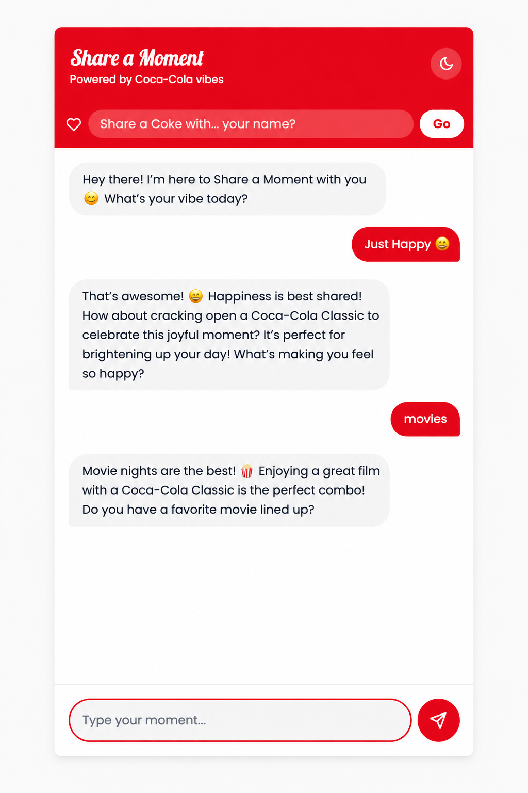

# 🥤 Share a Moment — Coca-Cola Inspired AI Chatbot

> Open Happiness, One Chat at a Time
> 

[](https://openai.com/)
[](https://tailwindcss.com/)
[](https://opensource.org/licenses/MIT)

A mobile-first AI chatbot inspired by The Coca-Cola Company's emotional branding strategy. The experience focuses on happiness, personalization, and real-time conversation through an interactive AI companion.

The chatbot creates emotionally engaging conversations using mood-based responses, animated interactions, and personalized “Share a Coke” moments.

---

## ✨ Features

| Brand Strategy        | Implementation                                                 |
| --------------------- | -------------------------------------------------------------- |
| Emotional Connection  | Mood-aware AI tone, empathetic responses, typing animation     |
| Happiness & Lifestyle | Occasion-based drink recommendations and uplifting responses   |
| Personalization       | “Share a Coke” name capture and personalized replies           |
| Brand Identity        | Coca-Cola inspired red-white UI and contour-style chat bubbles |
| Interactive UX        | Quick reply cards, smooth animations, confetti celebration     |
| Mobile First Design   | Responsive chat layout optimized for mobile experience         |

---

## 🎨 Core UX Highlights

* Mood-based dynamic UI colors
* Coca-Cola inspired contour bottle chat bubbles
* Animated typing indicator
* Dark / Light mode support
* Quick reply mood cards
* Personalized welcome experience
* Smooth Framer Motion animations

---

## 🛠 Tech Stack

* HTML5
* React 18 (CDN)
* Tailwind CSS
* Framer Motion
* OpenAI GPT-4o-mini API
* Canvas Confetti

---

## 🚀 Run Locally

### 1. Clone Repository

```bash
git clone https://github.com/Ruthwik-Data/shareamoment.git
cd shareamoment
```

### 2. Open Project

Open `code.html` in:

* VS Code Live Preview
* or Live Server

### 3. Add OpenAI API Key

Inside `code.html` replace:

```javascript
const OPENAI_API_KEY = 'YOUR_OPENAI_KEY_HERE';
```

with your OpenAI API key.

---

## 🔐 Security Note

Do not expose your OpenAI API key publicly.

For production applications, use:

* environment variables
* backend API proxy
* server-side authentication

---

## 📱 Experience Features

* Mood-aware conversations
* Personalized greetings
* Coca-Cola themed interaction design
* Occasion-based drink suggestions
* Smooth animated UI
* Mobile optimized experience

---

## 💡 Inspiration

Inspired by Coca-Cola’s emotional marketing campaigns and the idea of creating digital experiences centered around human connection, celebration, and shared moments.

---

## 📄 License

MIT License

---

## 👨‍💻 Author

Built by Ruthvik
